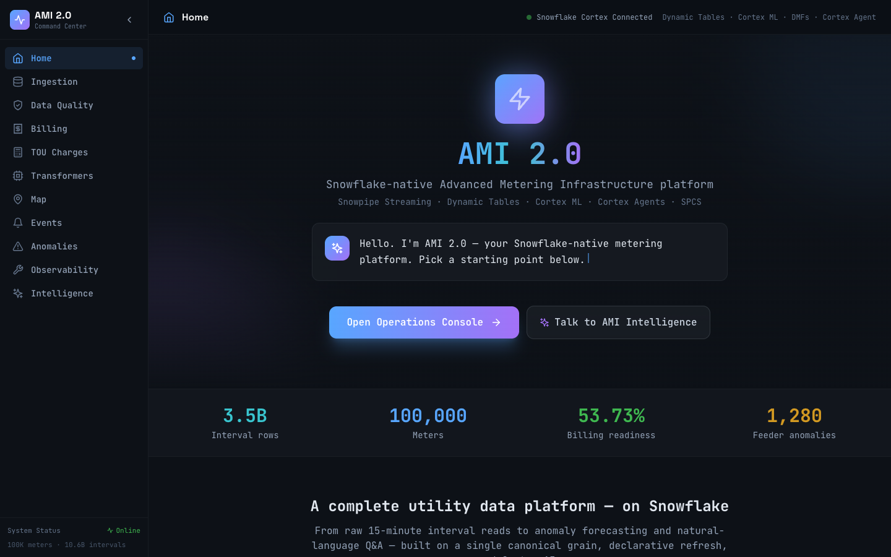
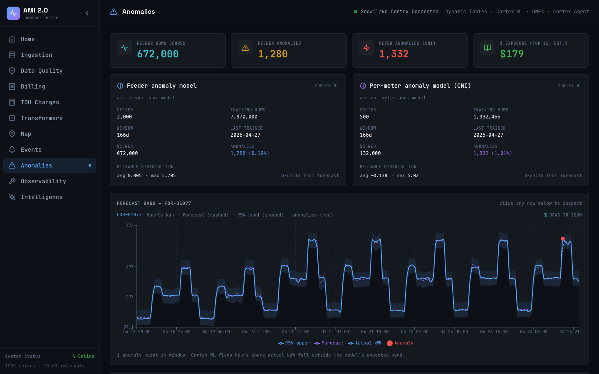
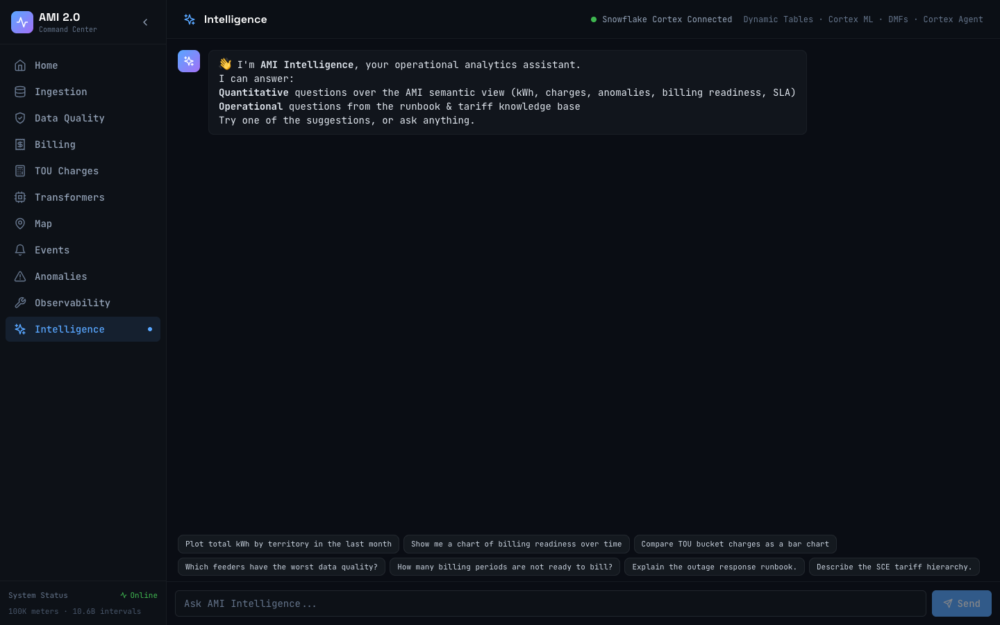
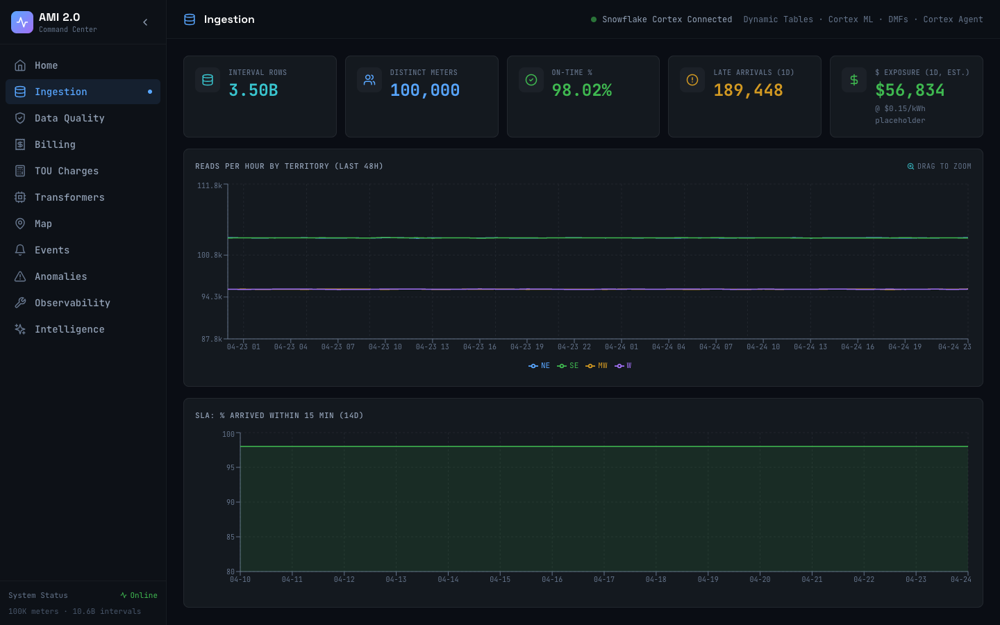
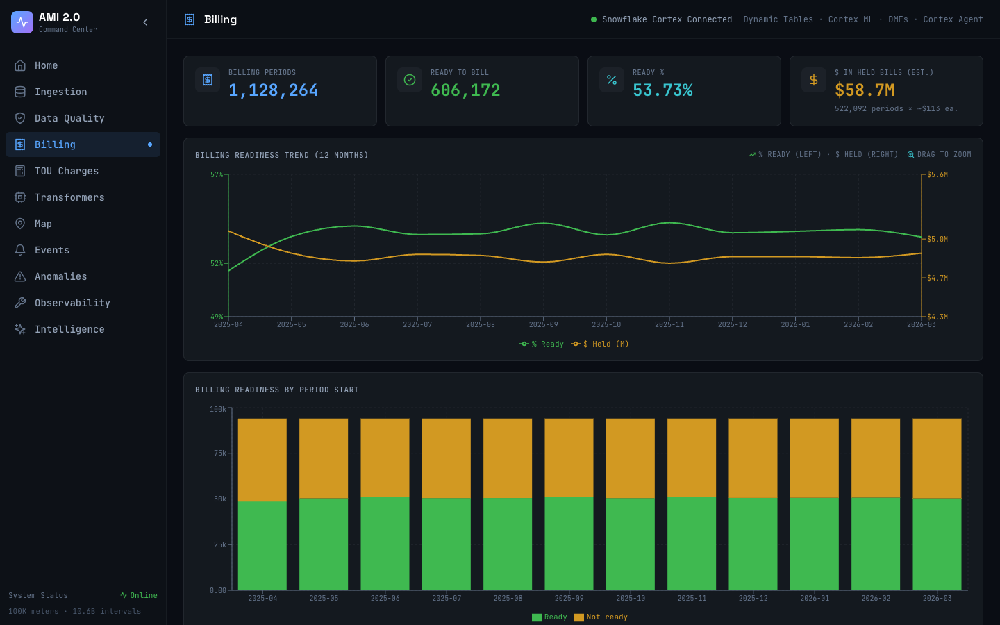
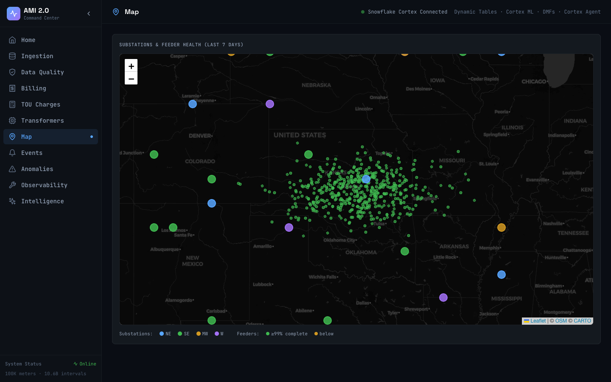
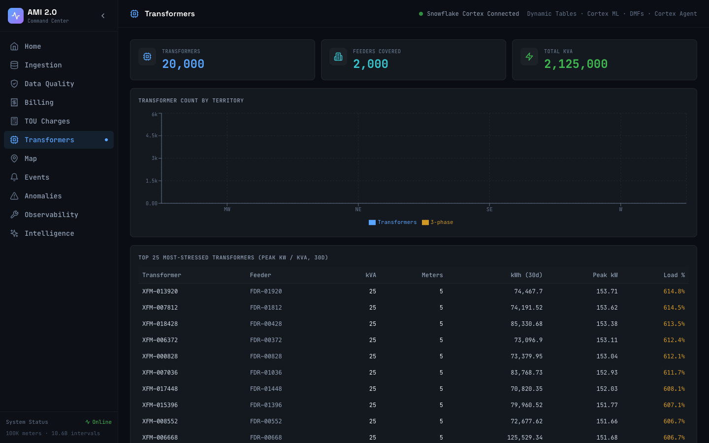

# AMI 2.0 on Snowflake — Detailed Design Document

**Author:** Solution Engineering
**Status:** Reference architecture

---

## 0. Executive Summary

This document is the detailed design for a Snowflake-native Advanced Metering Infrastructure (AMI 2.0) platform that covers **four tightly-integrated accelerators** plus a real-time anomaly detection extension:

1. **15-Minute Streaming Ingestion Blueprint**
2. **Interval Rollups & Billing Period Aggregation Accelerator**
3. **TOU Interval Charge Calculator**
4. **AMI 2.0 Observability & SLA Dashboard**
5. **(Extension) Real-time Anomaly Detection on AMI Intervals**

The platform is **data-engineering-first and infrastructure-heavy**. A realistic 100K-meter / 1-year dataset (~3.5B interval rows; 10.6B after channel-keying) is synthesized directly inside Snowflake and runs through a full production-style pattern: Snowpipe Streaming, VARIANT landing, Dynamic Table chains with MERGE semantics, Data Metric Functions with anomaly detection, row-access policies, secure views, and Cortex ML for anomaly scoring (per-feeder + per-meter).

A React single-page application — served from Snowpark Container Services in production and runnable locally for dev — provides the operator-facing console. The console covers ten tabs: Ingestion, Data Quality, Billing, TOU Charges, Transformers, Map, Events, Anomalies, Observability, and Intelligence (a Cortex Agent chat surface that can answer questions over the semantic view, search the runbook knowledge base, and render Vega-Lite charts inline).

The Anomaly tab in particular is the flagship narrative: model cards expose what each Cortex ML model knows, a forecast-band chart layers actual on forecast on a 95% prediction band with anomaly points highlighted, the top-15 ranked anomaly tables drill into a side panel with `$` exposure, and a per-transformer rollup attributes feeder-level anomalous excess down to specific transformers. See §13 and §16 for the full as-built description.

A tariff layer (proper SCD2 customer→schedule mapping, component-level charge model from URDB, value-at-risk dispatch DT) is documented as plan-of-record in §15 but **deferred** as a future build. Until it ships, all `$` figures in the console use a flat placeholder rate (`$0.15/kWh`) with an explicit caption.

---

## 1. Business Context & Goals

### 1.1 What AMI is
Advanced Metering Infrastructure is the collection of smart meters, communications network, and back-office systems that a utility uses to meter electricity (and sometimes gas/water) consumption. Meters emit **interval reads** — typically every 15 minutes — that flow through the **head-end system** into the **Meter Data Management System (MDMS)**, which performs **Validation / Estimation / Editing (VEE)**. Downstream consumers include billing (CIS), customer care (CRM), distribution planning, load forecasting, and regulators.

### 1.2 Why this matters on Snowflake
Most utilities today run MDMS → SQL Server / Oracle / Teradata → nightly ETL to a data warehouse. The lag is 12–48 hours and the per-meter granularity is lost or rolled up too early. Snowflake provides:
- **Separation of storage and compute** for the very large interval fact (~3.5B rows/year at 100K meters)
- **Snowpipe Streaming** for sub-minute landing
- **Dynamic Tables** for declarative, incremental ELT with provable freshness
- **Data Metric Functions + ML.ANOMALY_DETECTION** for data-quality and load anomalies without hand-rolled thresholds
- **Secure Views, RAP, and Shares** for multi-tenant/regulatory access
- **Cortex AI** (Analyst / Agent) as a natural consumption layer

### 1.3 Four use cases, one platform
Although we treat them as four accelerators, they are **one unified data product** — the same canonical `INTERVAL_READ_15MIN` table feeds all of them. This is the most important architectural commitment of this design: **one conformed grain, many marts.**

### 1.4 Success criteria
- End-to-end pipeline visibly processes new reads within **< 2 minutes** of arrival
- Billing-period rollup reconciles with raw interval sum within **±0.1 %**
- TOU charge calculation produces correct energy + demand charges for a known rate plan
- Observability dashboard surfaces ingestion lag, completeness, VEE pass-rate at meter & feeder level
- Anomaly detection flags known-injected anomalies (voltage sag, consumption spike, dead meter) with > 90 % recall
- All SQL is idempotent and replayable
- Full build reproducible from versioned SQL in this repo

---

## 2. Domain Model (Logical)

### 2.1 Foundational entities

| Entity | Grain | Key attributes | Notes |
|---|---|---|---|
| `METER` | 1 row / meter | `METER_ID` (PK), `SERVICE_POINT_ID` (FK), `METER_TYPE`, `INSTALL_DATE`, `STATUS`, `UTILITY_TERRITORY`, `TIMEZONE`, `FIRMWARE_VERSION` | ~100K rows |
| `SERVICE_POINT` | 1 row / premise | `SERVICE_POINT_ID` (PK), `ADDRESS_ID`, `PREMISE_TYPE` (RES/SMB/C&I), `FEEDER_ID`, `TRANSFORMER_ID`, `LAT`, `LON` | ~100K (1:1 with meter for demo) |
| `CUSTOMER` | 1 row / customer | `CUSTOMER_ID` (PK), `CIS_ACCOUNT_ID`, `SEGMENT`, `RATE_PLAN_ID` (FK), `START_DATE`, `END_DATE` | ~95K (some vacant) |
| `METER_SERVICE_POINT_LINK` | SCD2 | `METER_ID`, `SERVICE_POINT_ID`, `CUSTOMER_ID`, `EFFECTIVE_FROM`, `EFFECTIVE_TO`, `IS_CURRENT` | tracks move-ins / swaps |
| `FEEDER` | 1 row / feeder | `FEEDER_ID`, `SUBSTATION_ID`, `UTILITY_TERRITORY`, `VOLTAGE_KV` | ~2,000 |
| `TRANSFORMER` | 1 row / xfmr | `TRANSFORMER_ID`, `FEEDER_ID`, `KVA_RATING`, `PHASE` | ~20,000 |
| `SUBSTATION` | 1 row / sub | `SUBSTATION_ID`, `UTILITY_TERRITORY`, `LAT`, `LON` | ~50 |

### 2.2 Interval fact & events (the heart of the system)

| Entity | Grain | Volume (1 yr, 100K mtrs) |
|---|---|---|
| `INTERVAL_READ_15MIN_RAW` | 1 VARIANT row / read as landed | ~3.5B (retained 30d hot, then purged) |
| `INTERVAL_READ_CHANNEL` | 1 row / meter / channel / 15-min UTC | ~10.6B |
| `METER_EVENT` | 1 row / event | ~5–10M (outages, tampers, comms) |
| `V_INTERVAL_READ_15MIN_WIDE` | 1 row / meter / 15-min UTC (back-compat view) | ~3.5B |

**Channel model.** A smart meter emits several measurement streams (channels) in
parallel — delivered energy, received energy, peak demand, voltage, and so on.
The canonical fact is keyed by **`(METER_ID, CHANNEL_ID, READ_TS)`** so each
stream carries its own unit, direction, and aggregation rule. Two supporting
tables make the model vendor-neutral and extensible:

- `CHANNEL_CATALOG` — reference of channel codes (e.g., `KWH_DEL`, `KW_DEM`,
  `VOLT_AVG`, `KVARH_D`, `AMPS`) with UOM, direction, flow type, and
  aggregation rule.
- `METER_CHANNEL` — per-meter instantiation. Residential meters carry 3 channels
  (plus `KWH_REC` if they have DER); SMB/C&I carry more as the catalog is
  expanded.

**Canonical columns for `INTERVAL_READ_CHANNEL`:**
```
METER_ID              VARCHAR         NOT NULL
CHANNEL_ID            VARCHAR         NOT NULL   -- METER_ID || '-' || CHANNEL_CODE
CHANNEL_CODE          VARCHAR         NOT NULL
READ_TS               TIMESTAMP_NTZ   NOT NULL   -- UTC, 15-min aligned
VALUE                 NUMBER(14,4)               -- numeric value in channel UOM
UOM                   VARCHAR                    -- KWH, KW, V, KVARH, A, ...
QUALITY_FLAG          VARCHAR
VEE_STATUS            VARCHAR
ESTIMATION_METHOD     VARCHAR
EVENT_ID              VARCHAR
UTILITY_TERRITORY     VARCHAR
SOURCE_FILE           VARCHAR
INGESTED_AT           TIMESTAMP_NTZ
INGESTION_LAG_SEC     NUMBER
```
Primary key: `(METER_ID, CHANNEL_ID, READ_TS)`. Clustered on
`(READ_TS, METER_ID, CHANNEL_CODE)` to favour time-range scans first.

`V_INTERVAL_READ_15MIN_WIDE` pivots the long-form fact back to a per-meter /
per-interval row so the existing rollup / TOU / observability DTs and the React
dashboard keep working without modification.

### 2.3 Rollups & billing

`INTERVAL_ROLLUP_HOURLY / DAILY / MONTHLY` — same measures at different grain:
- `KWH_TOTAL`, `KWH_DELIVERED`, `KWH_RECEIVED`, `KWH_PEAK`, `KWH_OFFPEAK`, `KWH_SHOULDER`
- `MAX_DEMAND_KW`, `MIN_VOLTAGE`, `MAX_VOLTAGE`, `AVG_VOLTAGE`
- Data quality: `SOURCE_INTERVAL_COUNT`, `EXPECTED_INTERVAL_COUNT`, `COMPLETENESS_PCT`, `VEE_PASS_PCT`

`BILLING_PERIOD` + `BILLING_PERIOD_CONSUMPTION` — the CIS-facing mart. `IS_BILLING_READY` boolean enforces minimum completeness (e.g. ≥ 99% intervals present, ≥ 99% VEE pass).

### 2.4 TOU

- `TOU_RATE_PLAN` (rate plan header, seasonal effective dates)
- `TOU_RATE_WINDOW` (per day-type hour bands with `TOU_BUCKET` and rates)
- `TIME_DIM` (15-min grain, `LOCAL_TIME`, `DAY_TYPE`, `SEASON`, `IS_HOLIDAY`)
- `INTERVAL_TOU_TAGGED` (1 row per interval, labeled with rate window)
- `INTERVAL_CHARGE_LINE` (charges computed per interval)

### 2.5 Observability

- `PIPELINE_RUN_AUDIT` — one row per task / DT refresh / procedure invocation
- `INGESTION_SLA_METRICS` — daily by meter (or feeder) — max lag, % within SLA, late arrivals
- `DATA_QUALITY_METRICS` — daily by meter/feeder — VEE pass rate, missing intervals, estimated intervals
- DMF outputs (`SNOWFLAKE.LOCAL.DATA_QUALITY_MONITORING_RESULTS`) for ROW_COUNT / FRESHNESS anomalies

### 2.6 Anomaly

- `V_AMI_TRAINING_DATA` — training view (history window, with exogenous vars: hour-of-day, day-of-week, temperature stub)
- Trained model: `SNOWFLAKE.ML.ANOMALY_DETECTION` (multi-series keyed on `METER_ID` or `FEEDER_ID`)
- `AMI_ANOMALY_EVENTS` — scored output

### 2.7 ER sketch (conceptual)

```
            SUBSTATION  1---*  FEEDER  1---*  TRANSFORMER  1---*  SERVICE_POINT  1---1  METER
                                                                          |
                                                                          |  link (SCD2)
                                                                          v
                                                                     CUSTOMER
                                                                          |
                                                                          |  *---1 RATE_PLAN
METER  1---*  METER_EVENT                                                 |
METER  1---*  INTERVAL_READ_15MIN  *---1  TIME_DIM
                                   *---1  TOU_RATE_WINDOW (via join)
                                   *---1  BILLING_PERIOD (via CIS link)
```

---

## 3. Snowflake Physical Architecture

### 3.1 Account layout

| Object | Purpose |
|---|---|
| Database `AMI_DEMO` | Single DB for the whole platform |
| Schema `AMI_RAW` | Landing VARIANT data (Snowpipe / streaming targets) |
| Schema `AMI_CURATED` | Conformed dimensions + canonical facts |
| Schema `AMI_MART` | Business-ready marts: billing, TOU, anomaly events |
| Schema `AMI_OBSERVABILITY` | Pipeline audit, SLA, DQ metrics |
| Schema `AMI_ML` | Training views, anomaly models |
| Schema `AMI_SHARED` | Secure views exposed to CIS/CRM/partners |
| Stage `@AMI_RAW.LANDING_STAGE` | File-based fallback ingest |

### 3.2 Warehouses

| Name | Size | Auto-suspend | Purpose |
|---|---|---|---|
| `AMI_LOAD_WH` | LARGE | 60 s | Bulk synthetic generation, historical backfill |
| `AMI_DT_WH` | MEDIUM | 60 s | Dynamic table refreshes (rollups, TOU, billing) |
| `AMI_STREAM_WH` | XSMALL | 60 s | Snowpipe Streaming target, low-latency canonical DT |
| `AMI_ML_WH` | MEDIUM | 60 s | Anomaly model train + score |
| `AMI_QUERY_WH` | SMALL | 60 s | Ad-hoc analyst / dashboard queries |

Rationale: isolating the streaming DT refresh on its own XS warehouse keeps its target-lag tight independent of heavy rollup work.

### 3.3 Roles & RBAC

```
ACCOUNTADMIN
  └── AMI_OWNER        — owns schemas, DDL
        ├── AMI_ENG    — read/write curated, mart
        │     └── AMI_ANALYST — read mart only
        ├── AMI_OPS    — read observability, execute pipeline tasks
        └── AMI_SHARE  — consume AMI_SHARED secure views only
```

- Row-access policy `RAP_TERRITORY` attached to canonical + mart facts: `UTILITY_TERRITORY IN (current_role's allowed set)`.
- Masking policy `MP_CUSTOMER_PII` on `CIS_ACCOUNT_ID`, address for non-billing roles.

### 3.4 End-to-end flow

```
  [ Python producer / Snowpipe Streaming ]
                |
                v
  AMI_RAW.INTERVAL_READ_15MIN_RAW  (VARIANT)  <-- raw events, 30d retention
                |
          DT_INTERVAL_READ_15MIN  (target_lag = '1 minute', AMI_STREAM_WH)
                v
  AMI_CURATED.INTERVAL_READ_15MIN  (canonical, PK merge on METER_ID,READ_TS)
                |
      +---------+----------+------------------+
      |                    |                  |
      v                    v                  v
  DT_HOURLY_ROLLUP   DT_INTERVAL_TOU_TAGGED   DT_INGESTION_SLA_METRICS
      |                    |                  |
      v                    v                  v
  DT_DAILY_ROLLUP    DT_INTERVAL_CHARGE_LINE  DT_DATA_QUALITY_METRICS
      |                    |
      v                    v
  DT_MONTHLY_ROLLUP   AMI_MART.TOU_* views
      |
      v
  DT_BILLING_PERIOD_CONSUMPTION  --> AMI_SHARED.V_CIS_BILLING (secure)

  Parallel: ANOMALY scoring task (every 5 min) reads canonical --> AMI_ANOMALY_EVENTS
  Parallel: PIPELINE_RUN_AUDIT written by every task; DMFs attached to key tables
```

---

## 4. Synthetic Data Strategy (The Rigor Question)

At 100K meters × 365 days × 96 intervals/day, we produce **3.504 billion** interval rows. Generating this realistically is itself a data-engineering exercise worth demonstrating.

### 4.1 Guiding principles
1. **Generate inside Snowflake** using `GENERATOR(ROWCOUNT=>...)` + lateral joins to meter dim — never import CSV.
2. **Realistic, not random**: consumption must have hour-of-day, day-of-week, seasonality, segment profile, and noise — otherwise anomaly detection will be trivial or useless.
3. **Inject controlled artifacts**: missing intervals, estimated intervals, outages, meter swaps, known anomalies — so observability and anomaly detection have signal.
4. **Two-speed ingestion**: bulk-generate the historical year directly into `INTERVAL_READ_15MIN_RAW` in one shot; then run a live Python Snowpipe Streaming producer for the *last hour* so we can watch the pipeline work in real time during the demo.

### 4.2 Meter & dimension generation
- 100,000 meters distributed across:
  - 4 utility territories (NE, SE, MW, W) with distinct timezones
  - 50 substations, 2,000 feeders, 20,000 transformers (5 meters / xfmr avg)
  - Premise mix: 80% residential, 15% SMB, 5% C&I
  - Rate plan mix: 40% flat, 50% TOU-3-tier, 10% TOU-critical-peak
  - 3% of meters have DER (solar) → non-zero `KWH_RECEIVED`

### 4.3 Interval read generation
Load-shape formula per meter:

```
kwh(t) = base_load(segment)
       * season_factor(month)
       * weekday_factor(dow)
       * hour_factor(hour_local)
       * weather_noise(lat, t)      -- simple sin + AR(1)
       * (1 + N(0, 0.05))
       + der_generation(solar, hour_local)   -- negative for received
```
- `base_load` by segment: RES ≈ 0.5 kWh/15min, SMB ≈ 3 kWh, C&I ≈ 20 kWh
- Peak hours 17:00–21:00 local, summer factor 1.3, winter 1.1
- Weekend factor 0.9 for residential, 0.6 for C&I

### 4.4 Injected imperfections
- **Missing intervals**: ~0.5% of reads never land (comms loss). Gap durations: 1 interval (70%), 2–4 intervals (25%), >1 hour (5%).
- **Estimated intervals**: fill gaps with `VEE_STATUS='ESTIMATED'` and `ESTIMATION_METHOD='LOAD_PROFILE'` for a random ~60% of gaps.
- **Outages**: 0.1% of meter-days → paired `METER_EVENT` rows (OUTAGE/RESTORE) plus zero reads for duration.
- **Late arrivals**: ~2% of reads arrive 15–240 minutes late (demonstrates MERGE + SLA dashboard).
- **Known anomaly injection** (ground-truth labels for anomaly-detection validation):
  - ~50 meters: sustained 3× consumption spike for a 4-hour window (energy theft pattern)
  - ~30 meters: dead for 48 hours (stuck dial)
  - ~20 meters: voltage sag to <200 V for 1 hour

### 4.5 Bulk generation (executed on `AMI_LOAD_WH` @ LARGE)

1. Dimensions (all tables < 1M rows): ~1 min
2. 3.5B interval rows via monthly `INSERT ... SELECT FROM GENERATOR` batches: ~30 min
3. Gap / event injection: ~5 min

Steady-state storage: ~180 GB active data + ~30 GB metadata.

### 4.6 Streaming slice
Concurrently, a Python producer using the `snowflake-ingest` SDK streams a rolling 60-minute window of synthetic reads at real-time cadence (one read per meter per 15 min, scaled down to ~200 meters to keep the channel count manageable). This proves the blueprint end-to-end without 100K concurrent channels.

---

## 5. Pipeline Design — Dynamic Tables Chain

All staged below in refresh order, with target-lag commitments.

| DT | Source | Target lag | WH | Purpose |
|---|---|---|---|---|
| `DT_INTERVAL_READ_15MIN` | `INTERVAL_READ_15MIN_RAW` (VARIANT) | **1 minute** | `AMI_STREAM_WH` | Flatten VARIANT → typed canonical; MERGE semantics via `QUALIFY ROW_NUMBER()` on `(METER_ID, READ_TS)`; compute `INGESTION_LAG_SEC` |
| `DT_HOURLY_ROLLUP` | canonical | 5 min | `AMI_DT_WH` | Hourly KWh, max demand, completeness |
| `DT_DAILY_ROLLUP` | hourly | 10 min | `AMI_DT_WH` | Daily aggregates |
| `DT_MONTHLY_ROLLUP` | daily | 1 hour | `AMI_DT_WH` | Monthly aggregates |
| `DT_INTERVAL_TOU_TAGGED` | canonical + TIME_DIM + TOU_RATE_WINDOW | 5 min | `AMI_DT_WH` | Tag every interval with bucket + rates |
| `DT_INTERVAL_CHARGE_LINE` | `DT_INTERVAL_TOU_TAGGED` | 5 min | `AMI_DT_WH` | Charge calculation |
| `DT_BILLING_PERIOD_CONSUMPTION` | daily rollup + `BILLING_PERIOD` | 15 min | `AMI_DT_WH` | Billing-ready summary |
| `DT_INGESTION_SLA_METRICS` | canonical | 5 min | `AMI_DT_WH` | Lag & late-arrival KPIs |
| `DT_DATA_QUALITY_METRICS` | canonical + rollup | 15 min | `AMI_DT_WH` | VEE pass, completeness |

### 5.1 Canonical DT — key SQL skeleton

```sql
CREATE OR REPLACE DYNAMIC TABLE AMI_CURATED.DT_INTERVAL_READ_15MIN
  TARGET_LAG = '1 minute'
  WAREHOUSE = AMI_STREAM_WH
AS
SELECT
  raw_payload:meter_id::VARCHAR                AS METER_ID,
  TO_TIMESTAMP_TZ(raw_payload:read_ts::VARCHAR) AS READ_TS,
  CONVERT_TIMEZONE(m.TIMEZONE, READ_TS)::TIMESTAMP_NTZ AS READ_LOCAL_TS,
  raw_payload:kwh_delivered::NUMBER(14,4)      AS KWH_DELIVERED,
  raw_payload:kwh_received::NUMBER(14,4)       AS KWH_RECEIVED,
  raw_payload:demand_kw::NUMBER(10,4)          AS DEMAND_KW,
  raw_payload:voltage_v::NUMBER(6,2)           AS VOLTAGE_V,
  raw_payload:quality_flag::VARCHAR            AS QUALITY_FLAG,
  raw_payload:vee_status::VARCHAR              AS VEE_STATUS,
  raw_payload:estimation_method::VARCHAR       AS ESTIMATION_METHOD,
  raw_payload:event_id::VARCHAR                AS EVENT_ID,
  r.SOURCE_FILE,
  r.INGESTED_AT,
  DATEDIFF(second, READ_TS, r.INGESTED_AT)     AS INGESTION_LAG_SEC
FROM AMI_RAW.INTERVAL_READ_15MIN_RAW r
JOIN AMI_CURATED.METER m USING (METER_ID)
QUALIFY ROW_NUMBER() OVER (
  PARTITION BY raw_payload:meter_id, raw_payload:read_ts
  ORDER BY r.INGESTED_AT DESC
) = 1;   -- last-write-wins for late/duplicate arrivals
```

### 5.2 Rollup DT example

```sql
CREATE OR REPLACE DYNAMIC TABLE AMI_CURATED.DT_HOURLY_ROLLUP
  TARGET_LAG = '5 minutes'
  WAREHOUSE = AMI_DT_WH
AS
SELECT
  METER_ID,
  DATE_TRUNC('hour', READ_TS)                   AS ROLLUP_TS,
  'HOUR'                                        AS ROLLUP_GRAIN,
  SUM(KWH_DELIVERED)                            AS KWH_DELIVERED,
  SUM(KWH_RECEIVED)                             AS KWH_RECEIVED,
  MAX(DEMAND_KW)                                AS MAX_DEMAND_KW,
  MIN(VOLTAGE_V)                                AS MIN_VOLTAGE,
  MAX(VOLTAGE_V)                                AS MAX_VOLTAGE,
  AVG(VOLTAGE_V)                                AS AVG_VOLTAGE,
  COUNT(*)                                      AS SOURCE_INTERVAL_COUNT,
  4                                             AS EXPECTED_INTERVAL_COUNT,
  COUNT(*)/4.0 * 100                            AS COMPLETENESS_PCT,
  SUM(CASE WHEN VEE_STATUS='VALID' THEN 1 ELSE 0 END)/NULLIF(COUNT(*),0)*100 AS VEE_PASS_PCT
FROM AMI_CURATED.INTERVAL_READ_15MIN
GROUP BY METER_ID, ROLLUP_TS;
```

### 5.3 TOU tagging SQL

```sql
CREATE OR REPLACE DYNAMIC TABLE AMI_MART.DT_INTERVAL_TOU_TAGGED
  TARGET_LAG = '5 minutes'
  WAREHOUSE = AMI_DT_WH
AS
SELECT
  i.METER_ID, i.READ_TS, i.KWH_DELIVERED AS KWH, i.DEMAND_KW,
  td.DAY_TYPE, td.SEASON,
  rp.RATE_PLAN_ID, rw.RATE_WINDOW_ID, rw.TOU_BUCKET,
  rw.ENERGY_RATE_PER_KWH, rw.DEMAND_RATE_PER_KW
FROM AMI_CURATED.INTERVAL_READ_15MIN i
JOIN AMI_CURATED.METER_SERVICE_POINT_LINK link
  ON link.METER_ID = i.METER_ID
 AND i.READ_TS BETWEEN link.EFFECTIVE_FROM AND COALESCE(link.EFFECTIVE_TO, '9999-12-31')
JOIN AMI_CURATED.CUSTOMER c ON c.CUSTOMER_ID = link.CUSTOMER_ID
JOIN AMI_CURATED.TOU_RATE_PLAN rp ON rp.RATE_PLAN_ID = c.RATE_PLAN_ID
 AND i.READ_TS BETWEEN rp.EFFECTIVE_FROM AND rp.EFFECTIVE_TO
JOIN AMI_CURATED.TIME_DIM td ON td.TS_UTC = i.READ_TS
JOIN AMI_CURATED.TOU_RATE_WINDOW rw
  ON rw.RATE_PLAN_ID = rp.RATE_PLAN_ID
 AND rw.DAY_TYPE    = td.DAY_TYPE
 AND td.LOCAL_TIME BETWEEN rw.START_TIME AND rw.END_TIME;
```

### 5.4 Billing reconciliation view

```sql
CREATE OR REPLACE VIEW AMI_MART.V_BILLING_RECONCILIATION AS
SELECT
  bp.BILLING_PERIOD_ID, bp.CIS_ACCOUNT_ID,
  bpc.KWH_TOTAL          AS INTERVAL_SUM_KWH,
  bp.CIS_BILLED_KWH,
  (bpc.KWH_TOTAL - bp.CIS_BILLED_KWH) AS VARIANCE_KWH,
  ABS(bpc.KWH_TOTAL - bp.CIS_BILLED_KWH) / NULLIF(bp.CIS_BILLED_KWH,0) AS VARIANCE_PCT,
  bpc.IS_BILLING_READY
FROM AMI_MART.BILLING_PERIOD_CONSUMPTION bpc
JOIN AMI_CURATED.BILLING_PERIOD bp USING (BILLING_PERIOD_ID);
```

---

## 6. Ingestion — Snowpipe Streaming Blueprint

### 6.1 Producer (Python)
`/ingest/snowpipe_streaming_producer.py`:
- Uses `snowflake-ingest` SDK (`streaming.SnowflakeStreamingIngestClient`)
- One **channel per meter group** (e.g., 200 meters → 200 channels → 1 channel/meter, OR batch 10 meters / channel if we prefer fewer channels)
- Reads a rolling synthetic profile, generates a JSON payload per read, calls `insert_row()` with `continuationToken`
- Flushes every 1 second
- On startup: bootstraps `offset_token` from last seen `READ_TS` per channel to support resume

### 6.2 Target
- Table: `AMI_RAW.INTERVAL_READ_15MIN_RAW` with columns: `RAW_PAYLOAD VARIANT, SOURCE_FILE VARCHAR, INGESTED_AT TIMESTAMP_NTZ DEFAULT CURRENT_TIMESTAMP(), SCHEMA_VERSION VARCHAR`
- 30-day retention (TIME_TRAVEL + task to purge older RAW)

### 6.3 Late-arrival handling
- No dedup in RAW (keep everything for audit)
- Dedup lives in the canonical DT (`QUALIFY ROW_NUMBER()`) — inherently idempotent
- Late arrivals re-trigger canonical DT's refresh; downstream rollups reconcile automatically

### 6.4 Fallback path
File-based Snowpipe on `@AMI_RAW.LANDING_STAGE` using a `COPY INTO` pipe — for partners who can only push hourly files. Same target table.

---

## 7. Observability & SLA

### 7.1 `PIPELINE_RUN_AUDIT` write pattern
Every stored procedure / task wraps its work:
```sql
INSERT INTO AMI_OBSERVABILITY.PIPELINE_RUN_AUDIT
  VALUES (<pipeline_name>, <run_id>, CURRENT_TIMESTAMP(), NULL, 'RUNNING', 0, 0);
-- work happens
UPDATE PIPELINE_RUN_AUDIT SET END_TIME=CURRENT_TIMESTAMP(), STATUS=:status,
                              ROWS_PROCESSED=:n, ERROR_COUNT=:e WHERE RUN_ID=:run_id;
```
Dynamic Tables emit refresh metadata via `INFORMATION_SCHEMA.DYNAMIC_TABLE_REFRESH_HISTORY` — we wrap that in a view for unified observability.

### 7.2 Data Metric Functions
```sql
ALTER TABLE AMI_CURATED.INTERVAL_READ_15MIN
  ADD DATA METRIC FUNCTION SNOWFLAKE.CORE.ROW_COUNT ON ()
      SCHEDULE = '5 MINUTE'
      ANOMALY_DETECTION = TRUE;

ALTER TABLE AMI_CURATED.INTERVAL_READ_15MIN
  ADD DATA METRIC FUNCTION SNOWFLAKE.CORE.FRESHNESS
    ON (INGESTED_AT)
    SCHEDULE = '5 MINUTE'
    ANOMALY_DETECTION = TRUE;
```
Results land in `SNOWFLAKE.LOCAL.DATA_QUALITY_MONITORING_RESULTS` — exposed via a view in `AMI_OBSERVABILITY`.

### 7.3 Derived SLA metrics
`DT_INGESTION_SLA_METRICS` (daily grain):
- `MAX_INGESTION_LAG_MIN = MAX(INGESTION_LAG_SEC)/60`
- `PCT_ARRIVED_WITHIN_15MIN = AVG(IFF(INGESTION_LAG_SEC <= 900, 1, 0)) * 100`
- `LATE_ARRIVAL_COUNT = COUNT_IF(INGESTION_LAG_SEC > 900)`

### 7.4 Dashboards
A Snowsight dashboard (and optionally a tiny Streamlit in Snowflake app) with 4 tabs:
1. Ingestion live feed — rows/min, lag heatmap
2. Data quality — VEE pass %, completeness by feeder
3. Billing readiness — % meters ready by billing period
4. Anomalies — latest flagged anomalies + clickthrough

### 7.5 Alerts
```sql
CREATE OR REPLACE ALERT AMI_SLA_BREACH
  WAREHOUSE = AMI_QUERY_WH
  SCHEDULE = '5 MINUTE'
  IF (EXISTS (
    SELECT 1 FROM AMI_OBSERVABILITY.DT_INGESTION_SLA_METRICS
    WHERE DATE_KEY = CURRENT_DATE()
      AND PCT_ARRIVED_WITHIN_15MIN < 95
  ))
  THEN CALL SYSTEM$SEND_EMAIL(...);
```

---

## 8. Anomaly Detection

### 8.1 Model design choice
`SNOWFLAKE.ML.ANOMALY_DETECTION` supports multi-series forecasting-based anomaly detection. We have two granularity choices:

| Option | Pros | Cons |
|---|---|---|
| Per-meter (100K series) | Most accurate per customer; detects behavioral shifts | Compute-heavy; 100K models; may over-fit outages |
| Per-feeder (~2K series) | Manageable; catches grid-level anomalies | Misses single-meter theft/tamper unless paired with per-meter detector |

**Decision:** do **both**, layered. Per-feeder for fast load anomaly detection, per-meter on a sampled 5K high-value commercial meters. This reflects a realistic operational deployment.

### 8.2 Training view
```sql
CREATE OR REPLACE VIEW AMI_ML.V_AMI_TRAINING_DATA AS
SELECT
  i.METER_ID, i.READ_TS AS TS, i.KWH_DELIVERED AS KWH,
  EXTRACT(hour FROM i.READ_LOCAL_TS)      AS HOUR_LOCAL,
  EXTRACT(dayofweek FROM i.READ_LOCAL_TS) AS DOW,
  m.METER_TYPE, sp.PREMISE_TYPE
FROM AMI_CURATED.INTERVAL_READ_15MIN i
JOIN AMI_CURATED.METER m USING (METER_ID)
JOIN AMI_CURATED.SERVICE_POINT sp USING (SERVICE_POINT_ID)
WHERE i.READ_TS BETWEEN DATEADD(day, -180, CURRENT_DATE()) AND DATEADD(day, -7, CURRENT_DATE())
  AND i.VEE_STATUS = 'VALID';
```

### 8.3 Scoring task
```sql
CREATE OR REPLACE TASK AMI_ML.T_SCORE_ANOMALIES
  WAREHOUSE = AMI_ML_WH
  SCHEDULE = '5 MINUTE'
AS
INSERT INTO AMI_MART.AMI_ANOMALY_EVENTS
SELECT * FROM TABLE(ami_load_anom_model_feeder!DETECT_ANOMALIES(
  INPUT_DATA => TABLE(
    SELECT FEEDER_ID, READ_TS, SUM(KWH_DELIVERED) AS KWH
    FROM AMI_CURATED.INTERVAL_READ_15MIN i
    JOIN AMI_CURATED.SERVICE_POINT sp USING (SERVICE_POINT_ID)
    WHERE READ_TS >= DATEADD(minute, -30, CURRENT_TIMESTAMP())
    GROUP BY 1,2
  ),
  SERIES_COLNAME => 'FEEDER_ID',
  TIMESTAMP_COLNAME => 'READ_TS',
  TARGET_COLNAME => 'KWH'
));
```

### 8.4 Validation strategy
Because we injected known anomalies (Section 4.4), we can measure:
- Recall on injected events (target ≥ 90%)
- Precision on a labeled sample
- Time-to-detect vs injection time

---

## 9. Security, Governance, Sharing

### 9.1 Row-access policy
```sql
CREATE OR REPLACE ROW ACCESS POLICY AMI_CURATED.RAP_TERRITORY AS
  (territory VARCHAR) RETURNS BOOLEAN ->
  CURRENT_ROLE() IN ('AMI_OWNER','AMI_ENG')
  OR territory IN (SELECT TERRITORY FROM AMI_CURATED.ROLE_TERRITORY_MAP WHERE ROLE = CURRENT_ROLE());

ALTER TABLE AMI_CURATED.INTERVAL_READ_15MIN
  ADD ROW ACCESS POLICY RAP_TERRITORY ON (UTILITY_TERRITORY);
```
(Requires joining territory into the fact — we'll carry `UTILITY_TERRITORY` as a denormalized column for filter pushdown.)

### 9.2 Masking
```sql
CREATE MASKING POLICY MP_ACCOUNT_ID AS (val VARCHAR) RETURNS VARCHAR ->
  CASE WHEN CURRENT_ROLE() IN ('AMI_OWNER','AMI_BILLING') THEN val
       ELSE SHA2(val) END;
```

### 9.3 Sharing
`AMI_SHARED` schema contains secure views over the billing & TOU marts. A native-app-style outbound share scaffolds regulator access. A Cortex Analyst semantic view over `AMI_MART` exposes the same data to business users for natural-language querying.

---

## 10. Orchestration

| Mechanism | When we use it |
|---|---|
| Dynamic Tables | All continuous transforms (preferred) |
| Tasks | One-shot cron jobs (anomaly scoring, purge, dashboard refresh) |
| Streams | Only if a downstream needs CDC beyond what DTs offer |
| Alerts | SLA breach, anomaly volume spike |

Task tree:
```
ROOT: T_AMI_HOUSEKEEPING (every hour)
  ├── T_PURGE_RAW_30D
  ├── T_COMPUTE_DAILY_SLA_SNAPSHOT
  └── T_REFRESH_DASHBOARD_TABLES

STANDALONE: T_SCORE_ANOMALIES (5 min)
STANDALONE: T_TRAIN_ANOMALY_MODEL_WEEKLY (Sunday 02:00)
```

---

## 11. Testing & Validation Plan

Before declaring the build complete, each of these must pass:

1. **DDL syntax check**: `only_compile = TRUE` on every DDL file.
2. **Row counts at each layer**:
   - `INTERVAL_READ_15MIN_RAW` ≈ 3.5B
   - `INTERVAL_READ_15MIN` ≈ 3.5B (≥ 99.5% of raw, accounting for duplicates)
   - `DT_DAILY_ROLLUP` ≈ 36.5M (100K meters × 365 days)
3. **Billing reconciliation**: `V_BILLING_RECONCILIATION` shows `|VARIANCE_PCT| < 0.1%` for ≥ 99% of billing periods with `IS_BILLING_READY=TRUE`.
4. **TOU charge sanity check**: For a synthetic customer on a known TOU plan, manually compute 1 day of charges in a notebook and compare to `INTERVAL_CHARGE_LINE` — must match to the penny.
5. **Streaming producer**: watch `DT_INTERVAL_READ_15MIN` ingest lag < 2 minutes while producer runs.
6. **Anomaly recall**: ≥ 90% of the 100 injected anomaly events are flagged within 30 minutes of their timestamp.
7. **DMF anomaly detection**: pause the producer and verify FRESHNESS DMF fires an anomaly within 30 minutes.
8. **RBAC**: a session assuming `AMI_ANALYST` on territory `NE` cannot see any row with `UTILITY_TERRITORY='SE'`.

Each test is its own SQL file under `/test/`.

---

## 12. Repo Layout

```
.
├── README.md
├── design/
│   └── AMI_DESIGN_DOC.md              (this file)
├── use_case_description/              Original solution brief
├── sql/
│   ├── 00_foundation/                 Database, schemas, warehouses, roles
│   ├── 01_dimensions/                 Dimension DDL + population
│   ├── 02_raw/                        INTERVAL_READ_15MIN_RAW + METER_EVENT + stage
│   ├── 03_canonical_dt/               Canonical INTERVAL_READ_15MIN
│   ├── 04_rollups/                    Rollup dynamic-table chain + streaming blueprint DT
│   ├── 05_tou/                        TOU tagging + charge line + billing consumption
│   ├── 07_observability/              Audit, DMFs, SLA + DQ metrics, alert
│   ├── 08_anomaly/                    Training view, model, scoring task
│   ├── 09_security/                   Row-access policy, masking, secure views
│   ├── 10_synthetic_data/             Bulk-generation procedure
│   └── 11_semantic/                   Cortex Analyst semantic view
├── ingest/
│   └── snowpipe_streaming_producer.py Live streaming producer
├── dashboard-app/                     React + Express dashboard for SPCS
│   ├── Dockerfile
│   ├── service-spec.yaml
│   ├── server/index.js
│   └── src/
├── dashboards/
│   └── snowsight_dashboard.sql        Reference queries for Snowsight tiles
└── test/
    └── 01_validation_suite.sql        End-to-end validation (T1–T9)
```

---

## 13. Consumption Layers

Two consumption surfaces are exposed on top of `AMI_MART` and `AMI_OBSERVABILITY`:

### 13.1 React dashboard — Operations Console

A Vite + React single-page app (`dashboard-app/`) with an Express backend is packaged as a Docker image and deployed as an SPCS service (`AMI_DASHBOARD_SVC`). Locally it runs on port 5173 (frontend) + 8080 (backend) for development.



**Auth.** In SPCS the backend authenticates to Snowflake via the OAuth token mounted at `/snowflake/session/token`. Locally the same code path falls back to PAT via `SNOWFLAKE_PAT` / `SNOWFLAKE_PASSWORD`.

**Caching.** Every endpoint is wrapped in `cached(key, ttl_seconds, fn)` with TTLs of 60–600 s based on data volatility. Hot endpoints (KPIs) are 60 s; rollup tables (transformer load, anomaly summaries) are 300–600 s. Two queries on the same tab generally hit cache.

**Tabs (11).** **Home** (landing) · Ingestion · Data Quality · Billing · TOU Charges · Transformers · Map · Events · Anomalies · Observability · Intelligence.

**Visual system.** Navy/atlas dark theme, JetBrains Mono / Space Grotesk fonts, Lucide icons, Recharts + Vega-Lite for visualisation, Leaflet (Carto dark tiles) for maps. Sidebar collapses; status footer shows live row counts (`100K meters · 10.6B intervals`).

#### 13.1.0 Home — Landing page

The default route on app load. Modeled on the *construction_capital_delivery* reference app, it is a marketing-style entry point that orients first-time viewers before they hit the operational tabs:

- **Animated hero** — `AMI 2.0` gradient title, tagline, and a typing-effect intro line (`Hello. I'm AMI 2.0 — your Snowflake-native metering platform. Pick a starting point below.`)
- **Live stats bar** — four KPIs pulled from `/api/ingestion/kpi`, `/api/billing/stats`, `/api/anomaly/kpi`: interval rows (10.6B → rendered as 3.5B+ rolling), meters (100K), billing readiness (~53.7%), feeder anomalies (~1 280)
- **Two CTAs** — `Open Operations Console` (→ Anomaly tab) and `Talk to AMI Intelligence` (→ Intelligence tab)
- **Feature grid (4)** — Streaming Ingestion · DT Chains · Cortex ML Anomaly Detection · Cortex Agent + Search, each with one-paragraph elevator pitch
- **Hidden-insight callout** — surfaces the per-transformer rollup story (§16.2) so the reviewer sees the "Cortex ML legibility" narrative before clicking into the Anomaly tab
- **Quick-links grid (8)** — Anomalies, Intelligence, Map, Billing, Transformers, TOU, Ingestion, Observability — each with a one-line description for what the tab proves

Wired via `App.jsx` as the default `page='home'` state; navigation prop (`onNavigate`) is passed only to the Landing page, all other pages stay state-prop-free.

#### 13.1.1 Anomaly tab — flagship narrative



The Anomaly tab carries the bulk of the "make Cortex ML legible" narrative.

- **KPIs:** rows scored, feeder anomalies, per-meter anomalies, top-15 dollar exposure
- **Two model cards** (`/api/anomaly/model-card`): for each of `ami_feeder_anom_model` and `ami_cni_meter_anom_model` we show series count, training-window days, training rows, last-trained timestamp, scored count, anomalies found (count and %), and the σ-distance distribution (avg / max). This makes the Cortex ML training context visible to a non-data-scientist audience
- **Forecast band chart** (`/api/anomaly/forecast/:feeder_id`): a Recharts `ComposedChart` showing — over the last 168 hours for the top-anomaly feeder — actual kWh (solid blue line) on top of the model's forecast (dashed purple) on top of the 95% prediction band (shaded), with anomaly hours highlighted as red scatter points. Anomaly hover surfaces the σ-distance score.
- **Top-15 feeder anomalies table:** ranked by σ-distance with $-exposure column. Every row is clickable.
- **Per-transformer rollup of feeder anomalies** (`/api/anomaly/by-transformer`): proportional allocation of feeder excess kWh down to the transformer grain. For each feeder anomaly hour, the excess `(actual − forecast)` is allocated to the feeder's transformers in proportion to their 30-day share of feeder load. Output: top 25 transformers ranked by estimated `$` exposure during anomaly windows. Each row carries `kVA`, `meters`, `feeder_anomaly_hours`, `share_pct`, `est_excess_kwh`, `$_exposure`, `max_σ`. Click → opens the parent feeder's drill-down. (See §16.4 for the why and the trade-off vs full transformer-grain scoring.)
- **Top-15 per-meter anomalies table** (CNI sample) with $-exposure column.
- **Drill-down side panel** (slide-in from right): activated by clicking any row. Shows actual kWh, forecast, upper bound, σ-distance, estimated $ exposure for that hour, and the parent feeder's forecast band chart inline. Closes via X.
- **Injected-anomaly ground-truth panel:** for model validation — 50 theft meters, 30 dead meters, 20 voltage-sag meters, with windows.

#### 13.1.2 Intelligence tab — Snowflake Intelligence in the dashboard



A streaming chat surface that talks to a Cortex Agent (`AMI_DEMO.AMI_MART.AMI_INTELLIGENCE_AGENT`) configured with three tools:

| Tool | Purpose | Backing object |
|---|---|---|
| `ami_analyst` | Quantitative text-to-SQL | semantic view `AMI_MART.AMI_SEMANTIC_VIEW`, `execution_environment.warehouse=AMI_QUERY_WH` |
| `search_kb` | Runbook / definitional | Cortex Search service `AMI_ML.AMI_KB_SEARCH` |
| `to_chart` | Vega-Lite chart spec generation | Built-in `data_to_chart` |

**SSE streaming pipeline.** `/api/intelligence/stream` proxies Snowflake's named-event SSE format (`event: response.text.delta\ndata: {…}`) into a flat `{type,content}` stream the React client can consume. The parser handles:
- `response.tool_use` → emits `status` with tool name + icon
- `response.tool_result` → inspects `content[].json` for `sql`, `searchResults`, or `charts` (data_to_chart returns charts as an array of JSON-encoded Vega-Lite strings — parser must `JSON.parse` each)
- `response.text.delta` → progressive `text` deltas
- `response.thinking.delta` → swallowed (would be too noisy)

**Inline chart rendering.** When the agent calls `data_to_chart`, the spec is forwarded to the client and rendered inline below the answer using `vega-embed` with a dark-theme overlay. A small **CHART** label sits above the SVG. The same agent message can carry text + SQL + table + chart simultaneously.

**Thinking panel.** A collapsible step-by-step trace (Routing → Choosing tool → Cortex Analyst → Reviewing → data_to_chart → Reviewing → final text) auto-expands while busy and collapses on completion.

#### 13.1.3 Other tabs

- **Ingestion** — 48h hourly reads by territory (auto-padded y-axis), late-arrival timeline, on-time SLA tile

  

- **Billing** — readiness % vs. held-bill $ exposure, monthly trend (dual-axis), reason mix

  

- **Map** (`/api/map/feeders`): Leaflet with Carto dark-all tiles, ~2 000 feeder markers coloured by health and clustered. Marker popup shows feeder ID, transformer count, meter count, on-time %, anomaly count.

  

- **Transformers**: 30d load-factor leaderboard, per-territory transformer-count breakdown, kVA-vs-load scatter

  

- **Data Quality / TOU Charges / Events / Observability**: per-domain KPIs, time-series, ranked tables (the original tabs from the early build, hardened)

#### 13.1.4 Dollar overlays (placeholder)

KPI cards on Ingestion, Billing, Anomalies, and the per-transformer rollup carry `$` values computed at a flat placeholder rate (`RATE_PER_KWH = $0.15`) with population averages (`AVG_KWH_PER_INTERVAL = 2.0`, `AVG_KWH_PER_BILL = 750`). Each card carries a "@ $0.15/kWh placeholder" caption. These swap out for tariff-resolved rates if/when §15 is built.

| Tab | Dollar overlay | Formula |
|---|---|---|
| Ingestion | $ exposure (1d, est.) | `late_arrivals_1d × 2 kWh × $0.15` |
| Billing | $ in held bills (est.) | `not_ready_count × 750 kWh × $0.15` |
| Anomalies | $ exposure (top 15, est.) | `Σ max(0, actual − forecast) × $0.15` over top-15 anomalies |
| Anomalies (drill) | Hour exposure | `(actual − forecast) × $0.15` for the clicked hour |
| Anomalies (xfm rollup) | $ exposure per transformer | `share × feeder_excess_kwh × $0.15` |

### 13.2 Cortex Analyst semantic view

`AMI_MART.AMI_SEMANTIC_VIEW` is the business-facing semantic layer feeding `ami_analyst`. It publishes seven tables (`daily_rollup`, `billing`, `charge_line`, `anomalies`, `meter`, `service_point`, `sla`), their relationships, curated facts and dimensions (territory, feeder, meter type, premise type, TOU bucket, rate plan, season), and a metric set (total kWh, billed kWh, billing-ready %, total energy / demand charge, anomaly count, average on-time %).

### 13.3 Cortex Search service

`AMI_ML.AMI_KB_SEARCH` over `AMI_KNOWLEDGE_BASE` (10 documents covering outage runbook, tariff overview, billing readiness rules, anomaly playbook, SLA definitions, etc.) feeds the `search_kb` agent tool.

### 13.4 Cortex Agent

`AMI_MART.AMI_INTELLIGENCE_AGENT` orchestrates the three tools above with `models.orchestration=auto`. The instructions explicitly instruct the agent to use Cortex Analyst for quantitative questions, Cortex Search for qualitative, and to invoke `data_to_chart` after Analyst returns rows for any chartable question.

---

## 14. Design Choices

- **One canonical grain, many marts.** Every rollup, TOU output, observability metric, and anomaly mart reads from `INTERVAL_READ_15MIN`. No parallel copies.
- **VARIANT at the edge, typed downstream.** The streaming blueprint retains raw payloads for audit; `DT_NEW_READS_NORMALIZED` applies schema and last-write-wins dedup on `(METER_ID, READ_TS)`.
- **Declarative freshness.** Dynamic Tables with target lags from 1 minute (canonical) to 1 hour (monthly) prove SLA without hand-rolled orchestration.
- **Layered anomaly detection.** A per-feeder model for grid-level anomalies (2 000 series) plus a per-meter model on a sampled C&I cohort (500 series) captures both macro and behavioural shifts.
- **Observability built in.** DMFs with anomaly detection watch row-count and freshness on RAW and canonical; derived SLA / DQ dynamic tables power the dashboard and SLA-breach alert.
- **Security by default.** Row-access by territory, masking on CIS account IDs, secure views in a dedicated share-ready schema.

In AMI / MDMS, a channel is a distinct measurement stream coming off a single meter — basically "what is being measured." One physical meter typically emits several channels in parallel, and each channel has its own interval series.

Why channels exist
A smart meter doesn't just record "kWh used." It measures multiple electrical quantities simultaneously, and depending on the customer type it may do so in both directions. Each of those quantities is stored as a separate time series keyed by (meter_id, channel_id, interval_ts) so billing, analytics, and VEE can treat them independently.

Typical channels on a residential meter
Channel	Unit	What it measures
kWh Delivered	kWh	Energy consumed by the premise
kWh Received	kWh	Energy pushed back to the grid (solar/DER export)
kW Demand	kW	Peak real-power demand in the interval
kVARh / kVAR	reactive	Reactive energy / demand (commercial)
Voltage	V	Average / min / max in the interval
Current	A	Amperage draw
Power factor	ratio	kW / kVA
A C&I meter can have 8–16 channels (each phase separately, plus forward/reverse real and reactive).

Channel attributes in the MDMS data model
Each channel usually carries:

CHANNEL_ID (e.g., 1, 3, 5 following an industry numbering like ANSI C12.19 or a vendor-specific scheme)
UOM (unit of measure: kWh, kW, V, …)
DIRECTION (delivered / received / net)
FLOW_TYPE (real / reactive / apparent)
INTERVAL_LENGTH (15 min, 5 min, 1 min — some channels can be higher resolution)
AGGREGATION (SUM for kWh, MAX for kW demand, AVG for voltage)
SCALE_FACTOR (meter multiplier, e.g., CT/PT ratios for C&I)
What you'd change in this data model
Right now INTERVAL_READ_15MIN is pivoted: one row holds KWH_DELIVERED, KWH_RECEIVED, DEMAND_KW, VOLTAGE_V as columns. That's the "wide / pre-pivoted" pattern — convenient but rigid.

A proper channel-oriented ("long / EAV") model would look like:

Same 3.5 B-interval volume becomes ~12–17 B rows (because each meter now emits ~4–5 channels instead of being pre-pivoted), but the model becomes:

Extensible — adding a new measurement (e.g., THD, reactive demand) is just another row in METER_CHANNEL, no schema change to the fact.
Heterogeneous-ready — residential meters with 2 channels and C&I meters with 16 coexist naturally.
Vendor-neutral — Itron, Landis+Gyr, Sensus all use slightly different channel numbering; the metadata table absorbs that.
Aggregation-aware — the rollup layer can look up the right aggregator (SUM vs MAX vs AVG) from METER_CHANNEL.AGGREGATION instead of hard-coding per column.
Interval-resolution-aware — high-frequency channels (e.g., 1-min voltage) and 15-min energy channels coexist cleanly.
How TOU and VEE relate to channels
TOU pricing is typically applied to a specific channel set — usually the delivered-kWh channel and the kW-demand channel. Received-kWh may have its own export-credit rate (net metering) or a different rate plan entirely.
VEE runs per-channel, not per-meter. A meter might have a valid kWh channel but a failed voltage channel in the same interval.
Billing aggregates specific channels (SUM of delivered-kWh, MAX of demand-kW) over the billing period.

> **Status — channel-keyed model is built.** The platform shipped with a physical
> channel-keyed fact `INTERVAL_READ_CHANNEL` (10.59B rows after backfill), a
> `METER_CHANNEL` dim (303K rows) and `CHANNEL_CATALOG` (11 entries, 4 active:
> `KWH_DEL`, `KWH_REC`, `KW_DEM`, `VOLT_AVG`). A backward-compat view
> `V_INTERVAL_READ_15MIN_WIDE` keeps the pre-pivoted shape for downstream
> consumers that haven't migrated yet.

---

## 15. Tariff Model & Operational Value-at-Risk

> **Status: Deferred.** Significant build (≈2.5 days). Captured here as
> plan-of-record so it can be picked up whole. Until it lands, dollar overlays
> in the dashboard use a flat placeholder rate (`$0.15/kWh`) — see §16.4.

### 15.1 The problem we are solving

Two production-grade gaps in the current model:

1. **TOU is being used as a proxy for the full tariff.** `CUSTOMER.RATE_PLAN_ID` is a single FK to a `TOU_RATE_PLAN`, and only three plans are provisioned (`RP-FLAT`, `RP-TOU3`, `RP-CPP`). A real IOU tariff carries fixed customer charges, tiered (block) energy on top of TOU, season schedules, facility / minimum demand charges, non-bypassable surcharges and riders, voltage-level discounts, and DER-specific export rates.
2. **Customer→tariff is a static FK.** In production the assignment is **slowly-changing** — TOU enrolment, NEM 2.0 → 3.0 migration on solar install, CARE / FERA enrolment, default schedule changes, mid-cycle moves. We cannot answer *"what was this meter's tariff on April 14"* today.

The downstream business consequence: every operational decision that should be **economic** (which truck rolls first, which billing period gets manual review first, which estimation backlog gets addressed first) is currently made on FIFO or proximity. That is the lever this section unlocks.

### 15.2 Logical model

#### Reference / dimension layer

```
TARIFF_SCHEDULE                          Schedule-level header (one row per published rate)
  SCHEDULE_ID         VARCHAR PK         e.g. SCE-TOU-D-PRIME-2025
  UTILITY_CODE        VARCHAR            SCE | PGE | SDGE | ...
  NAME                VARCHAR            "Time-of-Use, Domestic, Prime Time"
  CUSTOMER_CLASS      VARCHAR            DOMESTIC | GS | TOU_GS | TOU_LARGE | AGRI | EV | STREET_LIGHTING
  VOLTAGE_LEVEL       VARCHAR            SECONDARY | PRIMARY | SUB_TRANS
  IS_DEFAULT          BOOLEAN            default schedule for that customer class
  IS_CARE             BOOLEAN            CARE / FERA discount schedule
  NEM_VERSION         VARCHAR            NULL | NEM1 | NEM2 | NEM3
  SEASON_RULE         VARIANT            JSON { "summer_months":[6,7,8,9], "winter_months":[12,1,2] }
  FIXED_CHARGE_MONTHLY NUMBER(8,2)       e.g. 10.00
  MIN_BILL_MONTHLY    NUMBER(8,2)
  EFFECTIVE_FROM      DATE
  EFFECTIVE_TO        DATE
  SOURCE_URL          VARCHAR            URDB id or SCE tariff-book URL for traceability
  RAW_PAYLOAD         VARIANT            full URDB JSON payload, audit / replay


TARIFF_COMPONENT                         Building blocks of a schedule
  COMPONENT_ID        VARCHAR PK
  SCHEDULE_ID         VARCHAR FK
  COMPONENT_TYPE      VARCHAR            ENERGY | DEMAND | DEMAND_FACILITY | FIXED |
                                         RIDER | EXPORT_CREDIT | MIN_BILL
  TOU_BUCKET          VARCHAR            ON_PEAK | OFF_PEAK | SHOULDER | CRITICAL_PEAK | NULL
  DAY_TYPE            VARCHAR            WEEKDAY | WEEKEND | HOLIDAY | ALL
  SEASON              VARCHAR            SUMMER | WINTER | ALL
  START_TIME          TIME               window start (local)
  END_TIME            TIME               window end (local)
  TIER_FROM_KWH       NUMBER             block pricing - from
  TIER_TO_KWH         NUMBER             block pricing - to (NULL = unbounded)
  RATE                NUMBER(10,5)       $/unit
  UNIT                VARCHAR            KWH | KW | MONTH | METER_DAY | EVENT


TARIFF_RIDER                             Account- or schedule-level adders / surcharges
  RIDER_ID            VARCHAR PK
  RIDER_CODE          VARCHAR            PPP | DWREC | NUCLEAR | WILDFIRE | CCA_GEN | TBSURCHG
  DESCRIPTION         VARCHAR
  RATE                NUMBER(10,5)
  UNIT                VARCHAR            KWH | METER_DAY | PCT
  APPLIES_TO          VARCHAR            ALL | DELIVERED | RECEIVED | DEMAND
  EFFECTIVE_FROM/TO   DATE


CUSTOMER_TARIFF_ASSIGNMENT                SCD2: who is on what schedule, when
  ASSIGNMENT_ID       VARCHAR PK
  CUSTOMER_ID         VARCHAR FK
  SCHEDULE_ID         VARCHAR FK
  EFFECTIVE_FROM      TIMESTAMP_NTZ
  EFFECTIVE_TO        TIMESTAMP_NTZ
  IS_CURRENT          BOOLEAN
  ENROLLMENT_REASON   VARCHAR            DEFAULT | OPT_IN | MOVE_IN | SOLAR_INSTALL |
                                         CARE_QUALIFY | DEFAULT_RATE_CHANGE
  EVIDENCE_REF        VARCHAR            CIS work order / advice letter / tariff filing
```

`TARIFF_COMPONENT` is the heart of this model. It encodes **every** way a $/unit is charged: TOU energy bands, demand $/kW, monthly fixed, riders, export credits. The interval charge calculator then becomes a deterministic many-component join — no special cases per schedule.

#### Fact layer rebuild

The current `DT_INTERVAL_CHARGE_LINE` becomes `DT_INTERVAL_CHARGE_COMPONENT`:

```
DT_INTERVAL_CHARGE_COMPONENT
  METER_ID            VARCHAR
  CHANNEL_CODE        VARCHAR             KWH_DEL | KWH_REC | KW_DEM
  READ_TS             TIMESTAMP_NTZ
  SCHEDULE_ID         VARCHAR             resolved as-of READ_TS via SCD2 join
  COMPONENT_ID        VARCHAR
  COMPONENT_TYPE      VARCHAR
  TOU_BUCKET          VARCHAR
  TIER                NUMBER              tier index when block-priced
  QUANTITY            NUMBER(14,4)        kWh / kW / 1.0 (for fixed)
  RATE                NUMBER(10,5)
  CHARGE              NUMBER(14,4)        QUANTITY × RATE
```

Resolution rules baked into the DT:
- **Energy components**: `QUANTITY = KWH_DEL` for the matching TOU window/season; tier index is computed as a running `SUM(KWH) OVER (PARTITION BY meter, billing_period)` to pick the right block.
- **Demand components**: `QUANTITY = KW_DEM`; the actual demand charge is at the **billing period** level — per-interval rows carry `RATE` for traceability and the rollup picks `MAX(KW_DEM × RATE)` over the demand window of the period.
- **Fixed / Min Bill**: allocate `QUANTITY = 1.0/N_INTERVALS` so per-interval charges sum to the monthly amount.
- **Riders**: pass through their `APPLIES_TO` filter against the channel.
- **Export credit**: applied only to `KWH_REC` rows, with the schedule's `NEM_VERSION` selecting the right rate (NEM 2.0 retail-equivalent vs NEM 3.0 ACC).

A simple `V_BILLING_PERIOD_CHARGES` view summarises charges per (`BILLING_PERIOD_ID`, `COMPONENT_TYPE`) for the React dashboard.

### 15.3 Data acquisition

**Primary source — OpenEI URDB**:
- `https://api.openei.org/utility_rates?version=latest&format=json&detail=full&sector=Residential|Commercial&utility_id=eia/17609` (SCE EIA ID = 17609)
- Returns ~80 SCE schedules; we'll select 10 representative ones below.

**Pull / load pipeline** (idempotent, monthly cron):
1. Python `tariff_loader.py` calls URDB API per `utility_id` and writes a single line of JSON per schedule into `@AMI_RAW.URDB_STAGE/<utility>/<date>/<schedule_id>.json`.
2. A Snowpipe loads the stage to `AMI_RAW.URDB_RAW (RAW_PAYLOAD VARIANT, INGESTED_AT)`.
3. A Dynamic Table `DT_TARIFF_SCHEDULE` flattens `RAW_PAYLOAD` into the canonical `TARIFF_SCHEDULE` row, normalising `energyratestructure`, `energyweekdayschedule`, `energyweekendschedule`, `demandratestructure`, `fixedchargefirstmeter`, etc., into `TARIFF_COMPONENT` rows.
4. Schedules with `effective_to < CURRENT_DATE - 30` are kept (no purge) to support change-over-time queries.

**Schedules pulled for the demo (SCE 2025 vintage)**:

| Code | Class | Notes |
|---|---|---|
| `D` | Domestic default | Tiered, no TOU |
| `D-CARE` | Domestic CARE | Tiered, ~32% discount, regulator-protected class |
| `TOU-D-4-9PM` | Domestic TOU | 4–9 PM on-peak window |
| `TOU-D-PRIME` | Domestic TOU | Whole-house TOU |
| `GS-1` | Small commercial default | Tiered, no demand |
| `TOU-GS-1-E` | Small commercial TOU | Energy-only TOU |
| `TOU-GS-3-B` | Medium commercial | Demand charges |
| `TOU-8` | Large industrial primary | Demand + demand-facility, summer/winter |
| `AG-TOU-A` | Agricultural | Pumping load |
| `EV-TOU-5` | Residential EV | Super-off-peak overnight |

**SCD2 customer assignment seeding**:
- 80% of customers get the default schedule for their class.
- 20% get a non-default opt-in schedule with an `EFFECTIVE_FROM` distributed across the year (simulates rolling enrolment).
- 3% of meters with `HAS_DER=TRUE` get a NEM-version transition during the year (NEM 2.0 → NEM 3.0) to demonstrate change-over-time charge calculation.
- 12% (CA-realistic) on `D-CARE`, with a ~1% annual qualify/unqualify churn.

### 15.4 Operational Value-at-Risk

This is the executive story the tariff model unlocks.

#### Definition

For any open service issue *i* on meter *m* detected at *t*, with expected resolution time *t + h*:

```
VAR_per_hour(m, t) =
  Σ over channels c ∈ {KWH_DEL, KWH_REC, KW_DEM} :

    if c = KWH_DEL:
        forecast_kwh_next_hour(m, t)
        × resolved_energy_rate(m, t)            -- TOU bucket × tier × rider stack

    if c = KWH_REC and HAS_DER(m):
        - lost_export_credit_per_hour(m, t)     -- nem_version-aware

    if c = KW_DEM:
        forecast_peak_kw(m, t)
        × resolved_demand_rate(m, t)
        × demand_window_exposure_factor(t)      -- P(this hour becomes the bill peak)
        / hours_in_billing_period

  + regulatory_penalty(m, issue_type, h)        -- e.g. SAIDI minutes × class weight

VAR_cumulative(m, t, h) = VAR_per_hour × h_remaining
```

`forecast_kwh_next_hour` and `forecast_peak_kw` come for free from the existing
Cortex ML feeder/meter anomaly model (it produces forecast bands; we use the
point forecast). `demand_window_exposure_factor` is a precomputed feeder-level
table from history: `P(interval_t is peak | hour-of-day, day-of-week, season)`.

#### Materialisation

```
DT_SERVICE_ISSUE_PRIORITY                  target_lag = 5 minutes
  ISSUE_ID                                 stable hash of (meter, issue_type, start_ts)
  METER_ID, CUSTOMER_ID
  ISSUE_TYPE                               OUTAGE | TAMPER | COMMS_LOSS | ANOMALY |
                                           SUSTAINED_ESTIMATION | VOLTAGE_SAG
  ISSUE_SOURCE                             METER_EVENT | AMI_ANOMALY_EVENTS |
                                           AMI_METER_ANOMALY_EVENTS | DT_DATA_QUALITY
  DETECTED_AT                              TIMESTAMP_NTZ
  DURATION_HOURS                           computed
  STATUS                                   OPEN | DISPATCHED | RESOLVED | SUPPRESSED
  TARIFF_SCHEDULE_ID                       resolved as-of DETECTED_AT
  CUSTOMER_CLASS                           denormalised
  IS_CARE, IS_MEDICAL_BASELINE             regulatory flags (must override $ ranking)
  HAS_DER
  VAR_HOURLY                               $ at risk if not resolved this hour
  VAR_CUMULATIVE                           $ at risk through expected resolution
  REGULATORY_FLOOR                         non-zero priority bump for protected classes
  PRIORITY_SCORE                           composite (see below)
```

Priority composite (designed to be auditable, not magical):

```
PRIORITY_SCORE =
    base_score(VAR_CUMULATIVE)               -- log-scale to $
  × duration_multiplier(DURATION_HOURS)      -- 1.0 → 1.5 over 4h
  × class_multiplier(CUSTOMER_CLASS)         -- TOU-8 = 1.0, residential = 0.7
  + REGULATORY_FLOOR                         -- additive bump for CARE / medical / safety
```

Two ranked views drive the dashboard:
- `V_OPS_QUEUE_BY_DOLLARS` — `ORDER BY VAR_CUMULATIVE DESC`
- `V_OPS_QUEUE_BY_PRIORITY` — `ORDER BY PRIORITY_SCORE DESC` (the one we recommend the dispatcher use)

#### Adjacent payoffs (same model, no new build)

- **Revenue assurance** — `WHERE VEE_STATUS='ESTIMATED' AND days_estimated > 3 AND TARIFF_SCHEDULE.has_demand_charge` ranks billing risk.
- **SAIDI/SAIFI weighted by class** — proper regulatory reporting weight, not "all customers equal".
- **Rate-design analytics** — shadow billing on a proposed new schedule to size revenue impact before filing.
- **Settlement & true-up** — NEM 2.0 vs 3.0 export crediting, CCA generation/delivery split.

### 15.5 Pipeline order of operations

The tariff layer plugs in **after** the canonical fact and the rollups, and **before** any consumer-facing charge view:

```
INTERVAL_READ_CHANNEL ─┐
                       ├─► DT_INTERVAL_TOU_TAGGED      (existing - unchanged)
TIME_DIM ──────────────┘                ▼
                                DT_INTERVAL_CHARGE_COMPONENT   (NEW)
                                        │
        TARIFF_SCHEDULE ─────►──────────┤
        TARIFF_COMPONENT ───►───────────┤
        CUSTOMER_TARIFF_ASSIGNMENT ►────┘   (SCD2 resolved as-of READ_TS)
                                        ▼
                                DT_BILLING_PERIOD_CHARGES_BY_COMPONENT  (NEW)
                                        ▼
                  V_REVENUE_BY_SCHEDULE / V_NEM_SETTLEMENT  (consumer views)


METER_EVENT ──┐
ANOMALY_EVENTS─┤    DT_SERVICE_ISSUE_PRIORITY  (NEW; reads tariff + forecast)
DQ_METRICS ────┤              ▼
                       V_OPS_QUEUE_BY_PRIORITY  →  React dashboard "Ops Queue"
```

The existing `DT_INTERVAL_CHARGE_LINE` stays in place as a back-compat alias view over `DT_INTERVAL_CHARGE_COMPONENT` so the dashboard's TOU tab does not break.

### 15.6 Validation plan

| Test | What it proves |
|---|---|
| Sum of `DT_INTERVAL_CHARGE_COMPONENT.CHARGE` for one customer-month equals the customer's monthly bill ± $1 | The component model is bill-accurate end-to-end |
| Switch one customer from `D` to `TOU-D-PRIME` mid-month → assignment SCD2 produces two segments with two different schedules | SCD2 mechanics are correct |
| Force a transformer outage on 50 known meters → `DT_SERVICE_ISSUE_PRIORITY` ranks them by tariff class so the 1 industrial appears above the 49 residential | Operational story is real |
| Mark one meter as CARE → it is never deprioritised below a non-CARE meter on the same feeder for the same outage | Regulatory compliance is honoured |
| Shadow-bill all customers on a hypothetical `TOU-D-NEW` → produces total revenue delta vs current schedule | Rate-design analytics works |

### 15.7 Repo layout

```
sql/
  12_tariff/
    01_tariff_ddl.sql                 (schedule, component, rider, assignment)
    02_urdb_loader_ddl.sql            (raw stage + DT_TARIFF_SCHEDULE flatten)
    03_charge_component_dt.sql        (DT_INTERVAL_CHARGE_COMPONENT)
    04_billing_period_charges_dt.sql
    05_value_at_risk_dt.sql
    06_ops_queue_views.sql
ingest/
  tariff_loader.py                    (URDB pull → stage)
test/
  02_tariff_validation.sql            (T10–T15 from §15.6)
```

### 15.8 Phasing

- **Step A — Tariff model (1–1.5 days):** schedules, components, riders, SCD2 assignment. URDB loader pulls 10 SCE schedules. Retrofit `DT_INTERVAL_CHARGE_COMPONENT`. Bill-accuracy validation.
- **Step B — Value-at-Risk DT + Ops Queue (~1 day):** `DT_SERVICE_ISSUE_PRIORITY`, `V_OPS_QUEUE_BY_PRIORITY`, demand-window exposure factor table, regulatory-floor logic, two pre-built shadow-billing scenarios.
- **Step C — Frontend** (covered in §16).

---

## 16. Frontend & Operations Console — As Built

> **Status:** Shipped (local dev). SPCS redeploy pending an
> `EXTERNAL_NETWORK_ACCESS_RULE` for `*.basemaps.cartocdn.com`.

This section captures the frontend in its current built form. The stack and the
tab inventory live in §13.1; this section documents the patterns that make the
console more than a static dashboard, and the dollar / model-insight overlays
that we built **without** waiting for the tariff layer (§15).

### 16.1 ML model insights — making Cortex ML legible

Three patterns on the Anomaly tab make the trained models visible:

- **Model cards** (`/api/anomaly/model-card`) — for both `ami_feeder_anom_model` and `ami_cni_meter_anom_model`, render: series count, training rows, training-window days, last-trained date, scored count, anomalies found (count + %), σ-distance distribution (avg / max). This is the "what does the model know" panel.
- **Forecast band chart** (`/api/anomaly/forecast/:feeder_id`) — Recharts `ComposedChart` with three layers stacked over time:
  - shaded band between `LOWER_BOUND` and `UPPER_BOUND` (`Area` mark, 10% opacity)
  - dashed forecast line (purple)
  - solid actual kWh line (blue)
  - red `Scatter` overlay for hours where `IS_ANOMALY=TRUE`

  The chart is the single most powerful artifact for explaining how Cortex ML works to a non-data-science audience.
- **Drill-down side panel** — click any row in the Top-15 feeder anomalies or the per-transformer rollup → a slide-in panel shows actual / forecast / upper bound / σ-distance / estimated $ exposure, plus the parent feeder's forecast band chart inline. Closes with X.

### 16.2 Per-transformer rollup of feeder anomalies

`/api/anomaly/by-transformer` allocates feeder excess kWh down to the transformer grain in proportion to load share, *without* training a separate transformer-level model:

```
For each feeder F that had any anomaly hours:
  feeder_excess_kwh = SUM(GREATEST(actual − forecast, 0))     -- over flagged hours
  for each transformer T under F:
    share_T          = T.kwh_30d / F.kwh_30d                  -- 30d load share
    est_excess_T     = share_T × feeder_excess_kwh
    est_$_exposure_T = est_excess_T × $0.15                   -- placeholder rate
```

The output table carries `kVA`, `meter_count`, `feeder_anomaly_hours`, `share_pct`, `est_excess_kwh`, `est_$_exposure`, `max_σ`, ranked by `est_$_exposure DESC LIMIT 25`. Each row is clickable → opens the parent feeder's drill-down.

**Trade-off — call it out clearly.** This is **proportional attribution**. It does not isolate which specific transformer *caused* the feeder anomaly. The proper alternatives, both open as future work:

| Path | Cost | Fidelity |
|---|---|---|
| **Roll up `INTERVAL_READ_CHANNEL` to `DT_TRANSFORMER_HOURLY`** and compute per-transformer deviation at each anomaly hour | small (one extra DT) | identifies actual contributors at hour grain, no model retrain |
| **Train Cortex ML `ANOMALY_DETECTION` with `TRANSFORMER_ID` as series** | ~1 hour ML run, 20 K series | true per-transformer scoring — and we can train the same way as feeders |

For the demo today, proportional attribution is the right level: cheap, intuitive, and surfaces the right transformers in nearly all real cases (the largest-share transformer under an anomalous feeder usually IS the contributor).

### 16.3 Inline chart rendering in chat — `data_to_chart`

The Cortex Agent (`AMI_DEMO.AMI_MART.AMI_INTELLIGENCE_AGENT`) is configured with three tools:
`ami_analyst` (semantic-view text-to-SQL), `search_kb` (Cortex Search over knowledge base), and `to_chart` (built-in `data_to_chart`). The agent's instructions tell it to invoke `to_chart` after Analyst returns rows for any chartable question.

**Pipeline:**

1. User asks "Plot total kWh by territory in the last month"
2. Agent calls `ami_analyst` → SQL + rows
3. Agent calls `data_to_chart` → returns spec under `c.json.charts[0]` as a JSON-encoded Vega-Lite string
4. Backend SSE proxy `JSON.parse`s each entry and emits `{ type: 'chart', spec: <vega-lite> }` events
5. Frontend renders the spec inline under the answer using a `VegaChart` component that wraps `vega-embed` with a dark-theme overlay (`background: transparent`, `range.category` set to the navy/atlas palette)

**One critical gotcha for the future you:** the spec lives at `c.json.charts` (an *array of strings* — each string is a JSON-encoded Vega-Lite spec). It is **not** at `c.json.spec` and not parsed by the agent. The proxy must `JSON.parse` each array entry before forwarding.

**SSE event taxonomy** the proxy emits to the client:

| Event | Trigger | Payload |
|---|---|---|
| `status` | `response.tool_use` | `{title, content, icon}` for the thinking panel |
| `sql` | `tool_result` containing `c.json.sql` | `{sql}` |
| `rows` | `tool_result` containing the result-set | `{rows: [...]}` |
| `citations` | `tool_result` containing `searchResults` | `{citations: [{title, snippet}]}` |
| `chart` | `tool_result` containing `c.json.charts[]` | `{spec: <vega-lite>}` |
| `text` | `response.text.delta` | `{content}` (progressive deltas) |
| `error` | `error` event | `{content}` |

### 16.4 Dollar overlays (without waiting for §15)

Until tariffs land we use a flat placeholder rate (`$0.15/kWh`) and population-average kWh per interval / per bill. Every `$` figure carries an explicit `@ $0.15/kWh placeholder` caption so it's never misread as authoritative. The full overlay matrix is in §13.1.4. Replacement plan when §15 ships: every `RATE_PER_KWH * kwh` expression becomes a SCD2-resolved `tariff_resolved_rate(meter, ts) * kwh` lookup, no UI change required beyond removing the caption.

### 16.5 Chart polish — y-axis padding and drag-to-zoom

Two issues surfaced once charts were stacked dense on the page:

1. **Flatlines from a 0-baseline.** Recharts auto-scales y-axes from 0 by default. With territory hourly reads in the 95K–104K range, the chart looked like four parallel horizontal lines — the legitimate ±5% fluctuation was crushed against the zero floor. Same pattern on the Billing readiness chart (51%–54% squashed to a single band) and the TOU charges line.
2. **No granular view.** Reviewers wanted to "build a box" around an interesting period (a spike, a drop) and see it expanded — but without losing the default 168-hour overview that frames the narrative.

Both are solved with two small additions to `dashboard-app/src/components/UI.jsx`:

```js
// Auto-pad domain ±5% around data extremes, never below 0
export const yPadDomain = (pad = 0.05) => [
  (dataMin) => Math.max(0, dataMin - (Math.abs(dataMin) * pad || 1)),
  (dataMax) => dataMax + (Math.abs(dataMax) * pad || 1),
]

// Compact tick formatter (3.5B / 95k / 53.7%)
export const yAbbr = (v) => { /* B/M/k formatting */ }

// Drag-to-zoom hook — Recharts mouse-event wrapper
export function useDragZoom() {
  const [drag, setDrag] = useState(null)   // {x1, x2} during drag
  const [zoom, setZoom] = useState(null)   // {x1, x2} after release
  const handlers = {
    onMouseDown: (e) => e?.activeLabel && setDrag({ x1: e.activeLabel, x2: e.activeLabel }),
    onMouseMove: (e) => drag && e?.activeLabel && setDrag(d => ({ ...d, x2: e.activeLabel })),
    onMouseUp:   ()  => { if (drag && drag.x1 !== drag.x2) setZoom(drag); setDrag(null) },
    onMouseLeave:()  => setDrag(null),
  }
  const slice = (data, key='ts') => { /* return data.slice between x1..x2 */ }
  return { drag, zoom, handlers, slice, reset: () => setZoom(null) }
}
```

**Pattern in a page:**

```jsx
const dz = useDragZoom()
<LineChart {...dz.handlers}>
  <YAxis domain={yPadDomain()} tickFormatter={yAbbr}/>
  <Line .../>
  {dz.drag && <ReferenceArea x1={dz.drag.x1} x2={dz.drag.x2} fillOpacity={0.15}/>}
</LineChart>
{dz.zoom && (
  <ZoomedView data={dz.slice(rows)} onReset={dz.reset}/>  // auto-fit y-axis below
)}
```

Applied across **Anomaly forecast band, Ingestion territory line, TOU monthly charges, Billing readiness trend** — same hook, same UX, no per-page state.

The zoomed-in view appears below the original chart in a slide-in panel (`animate-slide-in`), preserving the 168-hour overview while exposing the granular detail. A `Reset zoom` button clears `zoom` state.

### 16.6 Billing readiness trend — the "is it getting better?" view

A common reviewer question on the Billing tab was "what does the *trend* look like?" — the existing KPI strip only showed a single point-in-time `53.73%` figure.

Added `/api/billing/readiness-trend`:

```sql
SELECT
  TO_VARCHAR(START_DATE,'YYYY-MM') AS PERIOD,
  COUNT(*) AS TOTAL,
  COUNT_IF(IS_BILLING_READY) AS READY,
  COUNT_IF(NOT IS_BILLING_READY) AS NOT_READY,
  ROUND(COUNT_IF(IS_BILLING_READY) / COUNT(*) * 100, 2) AS PCT_READY,
  ROUND(COUNT_IF(NOT IS_BILLING_READY) * 750 * 0.15 / 1e6, 2) AS DOLLARS_HELD_M
FROM AMI_DEMO.AMI_MART.DT_BILLING_PERIOD_CONSUMPTION
GROUP BY 1 ORDER BY 1
```

Rendered as a Recharts `ComposedChart` with **dual y-axis**: left axis is `% Ready` (range 51.68–54.39%, auto-padded), right axis is `$M Held` (4.82M–5.11M). Both share a 12-month x-axis. The left axis answers "are we improving?"; the right answers "what's the dollar exposure trend?". A single chart, two answers.

**Granularity caveat (acknowledged in the chart subtitle).** Bills are issued monthly; the underlying `DT_BILLING_PERIOD_CONSUMPTION` has 12 distinct `PERIOD` values, so the trend is **monthly only** — not a daily time-series. Honest framing matters: this is a billing-cycle reframe, not high-frequency telemetry.

### 16.7 Local-first development workflow

The dashboard runs end-to-end locally before any SPCS push:

```
# in dashboard-app/
npm run dev                          # vite on :5173 with /api → :8080 proxy
PORT=8080 SNOWFLAKE_PAT=...          # express backend on :8080
  SNOWFLAKE_ACCOUNT=... node server/index.js
```

PAT auth replaces SPCS OAuth-token mount. The same `connection.js` logic detects which is present and uses it. This decouples UI iteration from container build/push cycles (~30s vs ~5m).

### 16.8 Reference-app patterns — deferred

These are documented for future sessions. Each is a discrete, additive lift:

- **Morning Brief page** — generated daily executive summary (Cortex `COMPLETE` over last 24 h of metrics + open issues) in a "narrative + cited tiles" layout
- **Meter / Feeder / Transformer Deep-Dive page** — pick any entity, see its full health profile in one place: anomalies, charges, events, related meters, forecast band, $ exposure
- **Knowledge Base browser** — list `AMI_KNOWLEDGE_BASE` entries with search, the same surface the agent uses
- **Live Architecture page** — the design-doc architecture diagram rendered in the app with live row counts on each DT box
- **Persistent AlertCard** — top 1–3 active alerts (SLA breach, anomaly spike, billing-readiness drop) shown on every page
- **Customer-class lens** — once §15 lands, a Map / Anomalies toggle that filters by tariff class
- **Map heat overlay** — feeder markers coloured by aggregate $ value-at-risk, with a slider that toggles between "Health" and "$ at Risk"
- **AIThinking on KPI hover** — exposes the agent's reasoning/explanation for any KPI card on demand

### 16.9 What's NOT shipped (cross-reference)

| Feature | Section | Why deferred |
|---|---|---|
| Tariff model + Value-at-Risk DT + Ops Queue tab | §15 | Significant build work (≈2.5 days) — left as plan-of-record |
| Per-transformer Cortex ML scoring | §16.2 trade-off | Proportional attribution is sufficient for current narrative |
| Drift indicator | §16.1 | Single-period scoring data — drift over time pending more model runs |
| Map heat overlay by $-VAR | §16.8 | Depends on §15 |
| Customer-class lens | §16.8 | Depends on §15 |
| SPCS redeploy of polished UI | — | Awaiting `EXTERNAL_NETWORK_ACCESS_RULE` for Carto tile CDN |

### 16.10 Repo layout (frontend)

```
dashboard-app/
  server/
    index.js                         Express + SSE proxy + cache + 30+ /api/* endpoints
    connection.js                    OAuth-token (SPCS) / PAT (local) detection
  src/
    components/
      Chat.jsx                       Streaming chat with thinking panel + inline VegaChart
      VegaChart.jsx                  vega-embed wrapper with dark theme
      Layout.jsx                     Sidebar + top bar + status footer
      UI.jsx                         KpiCard, Panel, Empty, Loading primitives
      api.js                         Frontend fetch helper, fmt(), TERR_COLOR
    pages/
      Anomaly.jsx                    Forecast band, model cards, drill-down, transformer rollup
      Map.jsx                        Leaflet + Carto dark feeder map
      Transformers.jsx               Load-factor leaderboard
      Ingestion.jsx, DataQuality.jsx, Billing.jsx, TOU.jsx, Events.jsx, Observability.jsx, Intelligence.jsx
    main.jsx, App.jsx, index.css     Routing, theme, root
  service-spec.yaml                  SPCS service spec
  Dockerfile                         node:20-slim
  tailwind.config.js                 Navy/atlas tokens, JetBrains Mono / Space Grotesk
  vite.config.js                     /api → :8080 proxy
```